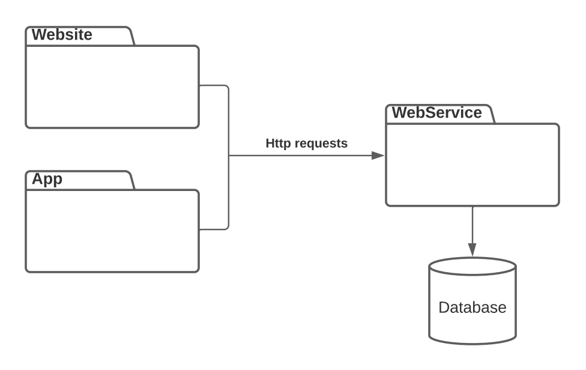
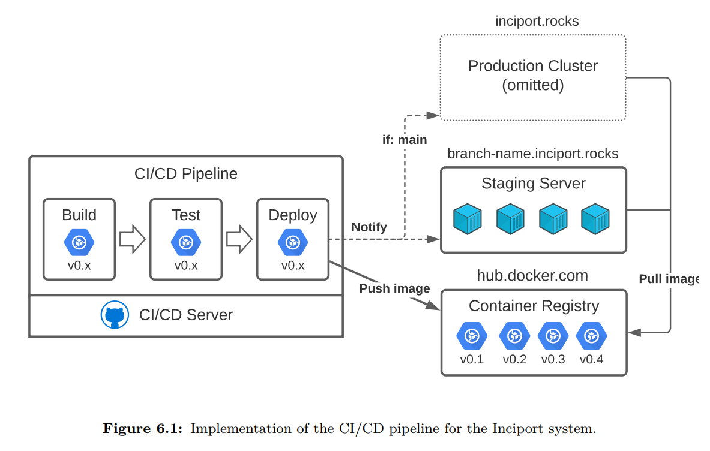
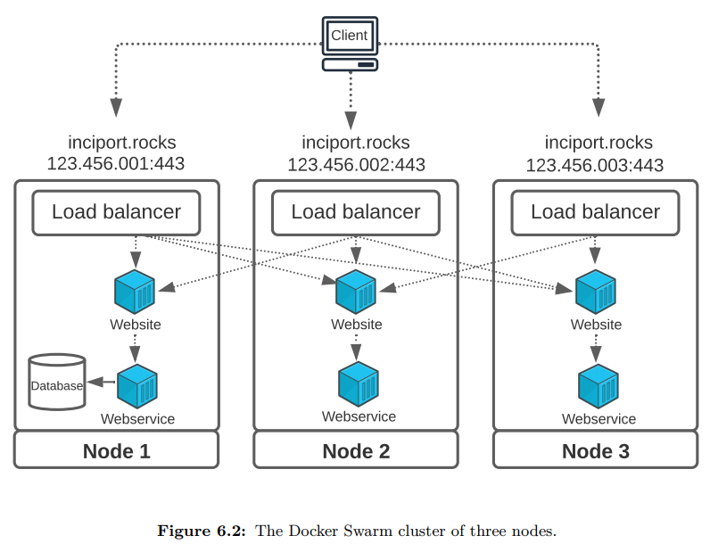

# Inciport

## About

An incident report service developed as a part of our P7 semester project on AAU (MSc in Software Engineering).

The project aims to make it easy for citizens to report incidents to their local municipality using a smartphone. The focus has been on making a dynamic solution rather than a static system only tailored for one particular municipality. The system is designed such that it is possible to create new municipalities, with each municipality having its own users and custom categories.

The system includes:

- Two clients: an app to report incidents and a website for the municpality administration to view and administrate the incident reports
- Backend: a web service connected to a database which serves the two clients via a RESTful interface using HTTP
- Authencication and authorization for website users with three different levels: manager, admin and maintainer (lowest to highest access level)
- Fully dockerized and scalable solution with possiblity to increase performance and availability by scaling the system to multiple nodes using Docker Swarm (NB: Database replication not possible ATM and is constrained to one node). As such, the system is easy to scale as more municipalities join the solution.
- CI/CD pipeline that build, test and deploys the system to either a staging server reachable on a domain in the format `branch-name.inciport.rocks` or, if pushed to the main branch, to the production server cluster on `inciport.rocks` and scaled onto the three nodes in the cluster.

#### Tech stack:

- Mobile App: Dart/Flutter
- Website: TypeScript/React
- Backend:
  - Web service: C#/ASP.NET + EF Core + Identity
  - Database: PostgreSQL
- Infrastructure:
  - Reverse proxy: Nginx
  - Containerization: Docker w. Compose
  - Container orchestration incl. load balancing: Docker Swarm
- Other:
  - Authentication and authorization: JWT
  - CI/CD: Github Actions

## Project Overview

The incident report service is seperated into three different main projects representing the app (`./inciport-app`), the website (`./inciport-website`) and the web service (`./inciport-webservice`).

Please refer to the `README.md` in each project folder to get more information about the specific project.

The `./docker` directory contains the different docker-compose configuration files used in the CI/CD pipeline, but can also be used to run the system in Docker locally (see `README.md` in the web service project).

`./nginx-proxy` contains the docker-compose configuration for the nginx proxy running on the staging/development server. The proxy automically discovers and auto-generates an nginx config file for each container that gets deployed on the server.

`./stress-test` contains files used for stress testing the application with the tool Locust.

Multiple CI/CD pipeline scripts are placed under `.github/workflows` which run in Github Actions:

- `cicd-prod.yml` builds, tests and deploys the website and web service to the production server (Swarm cluster)
  `build-test-deploy` is a resuable Github Action helper script that is used by the other scripts. It builds, tests and deploys the given service to a staging server.
- `staging-webservice.yml` builds, tests and deploys the web service
- `staging-website.yml` builds, tests and deploys the website
- `tests-app.yml` runs tests for the app
- `cicd-docker-build-deploy.yml` a resuable helper script that is used by `cicd-website.yml` and `cicd-webservice.yml`.

#### Production cluster

